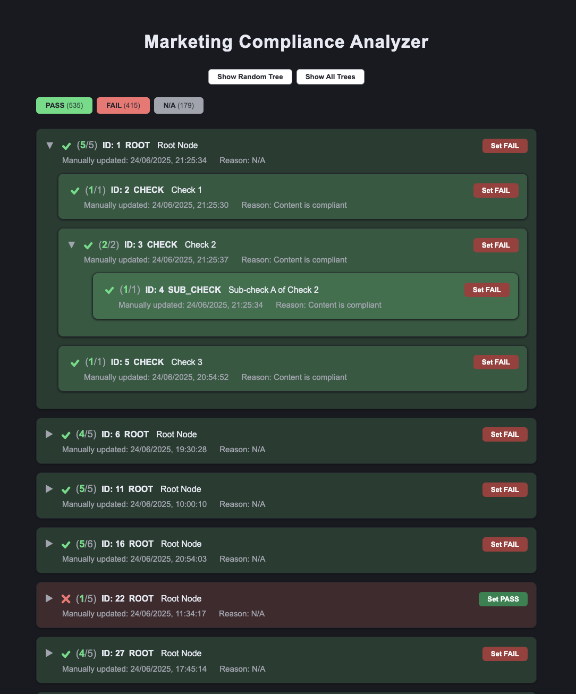

# Marketing Compliance Analyzer


A full-stack web application for visualizing and managing marketing compliance status through hierarchical tree structures with real-time status updates and audit trails.




## Overview

Marketing Compliance Analyzer is a web application designed for marketing teams to visualize, manage, and track the compliance status of marketing content. 

The application features a hierarchical tree view of compliance checks with real-time status propagation, audit trails, and an interface for status management.

---

## Key Features

### 🎯 Core Functionality
- **Hierarchical Tree Visualization**: 
- **Real-time Status Management**: 
- **Filter by PASS, FAIL, or N/A status with live counts**: 
- **History of all status changes with user attribution**: 

---

## Technology Stack

### Frontend
- **React 18** with TypeScript for type-safe component development
- **Vite** 
### Backend
- **FastAPI** 
- **SQLite** database with ACID compliance
- **Pydantic** for data validation and serialization

additional libraries
- **SQLAlchemy ORM** for database operations
- **Pydantic** for data validation and serialization

### Database
- **SQLite** with two main tables:
  - `nodes`: Hierarchical tree structure
  - `node_status_changes`: Complete audit trail

---

## Getting Started

### Prerequisites
- Python 3.8+ 
- Node.js 16+ (LTS recommended)
- Modern web browser

### 1. Clone the Repository
```bash
git clone <your-repo-url>
cd marketing-compliance-analyzer
```

### 2. Backend Setup

#### a. Create and activate virtual environment
```bash
cd backend
python3 -m venv ../.venv
source ../.venv/bin/activate  # On Windows: .venv\Scripts\activate
```

#### b. Install Python dependencies
```bash
pip install -r requirements.txt
```

#### c. Start the backend server
```bash
python app.py
```
The backend will run on **http://localhost:8001**

### 3. Frontend Setup

#### a. Install Node.js dependencies
```bash
cd ../frontend
npm install
```

#### b. Start the development server
```bash
npm run dev
```
The frontend will run on **http://localhost:3000**

### 4. Usage
1. Open **http://localhost:3000** in your browser
2. The app loads with "Show All Trees" view by default
3. Use the navigation buttons (PASS, FAIL, N/A) to switch between views:
   - **Show Random Tree**: Display a single random compliance tree
   - **Show All Trees**: Display all available compliance trees
4. Use the status filter buttons to show/hide nodes by status
5. Click status override buttons (SET PASS, SET FAIL) to change node compliance status
6. Expand/collapse nodes to explore the hierarchy

---

## API Endpoints

### Core Endpoints
- `GET /` - Retrieve a random root node with complete tree
- `GET /all` - Retrieve all root nodes with complete trees
- `POST /override/{node_id}` - Override node status with propagation
- `GET /override-history` - Get complete audit trail of user changes

### Request/Response Examples
```bash
# Get random tree
curl http://localhost:8001/

# Override node status
curl -X POST http://localhost:8001/override/123 \
  -H "Content-Type: application/json" \
  -d '{"status": "PASS"}'

# Get audit history
curl http://localhost:8001/override-history
```

---

## Project Structure

```
marketing-compliance-analyzer/
├── backend/
│   ├── app.py                 # FastAPI application with all endpoints
│   ├── requirements.txt       
│   └── newnorm.db            # SQLite database
├── frontend/
│   ├── src/
│   │   ├── App.tsx           # Main application component
│   │   ├── components/
│   │   │   ├── NodeRenderer.tsx    # Recursive node rendering
│   │   │   └── StatusFilter.tsx    # Status filter component
│   │   ├── hooks/
│   │   │   └── useTreeData.ts      
│   │   ├── utils/
│   │   │   ├── treeUtils.ts        
│   │   │   └── styles.ts          
│   │   └── types.ts               
│   ├── package.json          
│   └── vite.config.ts        
├── readme.md                 
└── technical-specifications.md # System specifications
```

---

## Key Features Explained

### Status Propagation Logic
When a node status is changed:
1. The node's status is updated in the database
2. The change is logged in the audit trail
3. Parent nodes are automatically updated:
   - If any child is FAIL → parent becomes FAIL
   - If all children are PASS → parent becomes PASS
   - Otherwise, parent status remains unchanged

### Audit Trail
Every status change is recorded with:
- Old and new status values
- Timestamp of change

## Development Notes

### Database Management
- The SQLite database (`newnorm.db`) contains sample data
### State Management
- Frontend uses React hooks for state management
- Backend maintains state in SQLite database

### Error Handling
- Basic try catch error handling

---

## Future Enhancements

- **More Engaging UI**: Responsive design improvements
- **User Authentication**: Role-based access control
- **Advanced Filtering**: Date ranges, custom filters
- **Export Functionality**: PDF reports, CSV exports
- **Mobile Optimization**: Responsive design improvements

